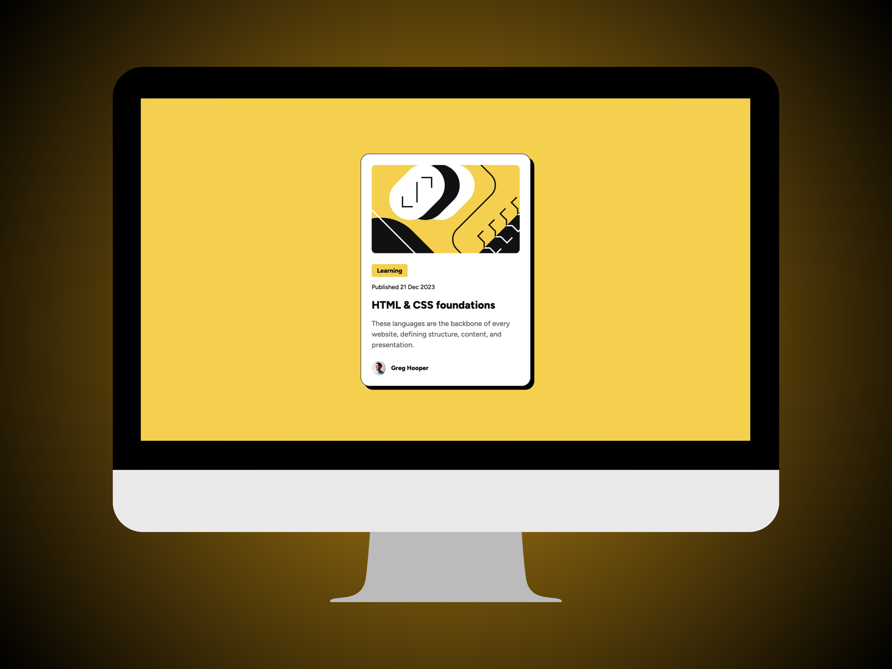
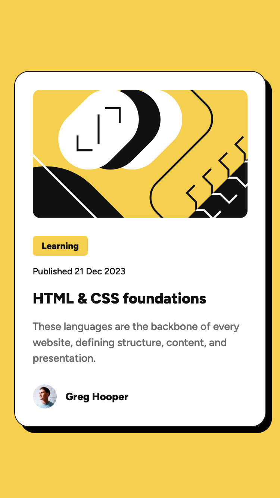

# Frontend Mentor - Blog preview card solution

This is a solution to the [Blog preview card challenge on Frontend Mentor](https://www.frontendmentor.io/challenges/blog-preview-card-ckPaj01IcS). Frontend Mentor challenges help you improve your coding skills by building realistic projects.

### Screenshot

### Links

- Solution URL: [View Code](https://github.com/umwebdev/blog-preview-card)
- Live Site URL: [Preview Live](https://femblog-preview-card.vercel.app/)

### Built with

- HTML
- CSS

## Author

- Website - [umwebdev](https://www.umweb.dev)
- Frontend Mentor - [@umwebdev](https://www.frontendmentor.io/profile/umwebdev)
- LinkedIn - [usamamustafa](https://www.linkedin.com/in/usama-m-01b869130/)
- X (Twitter) - [umwebdev](https://x.com/umwebdev)
